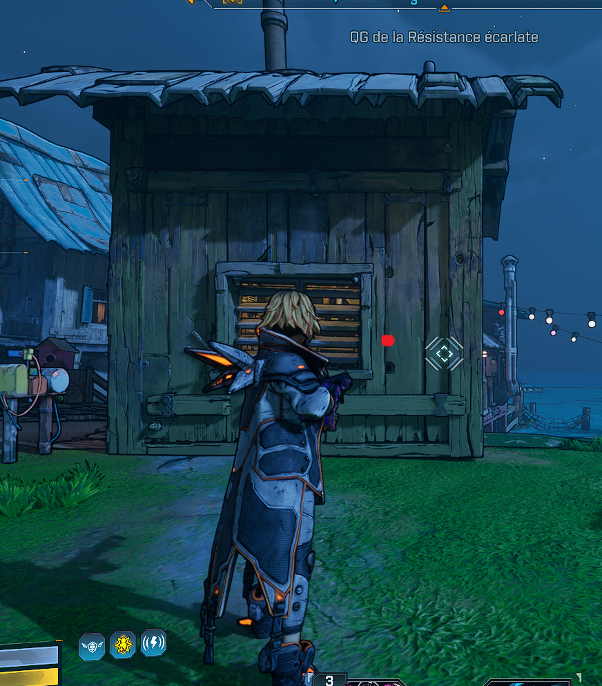

# BL4 Third Person PoC 0.3.8.17 — Epic Games test report

Hi Maxunit,

We tested your original **0.3.8.17** package on the Epic Games version of
Borderlands 4. **The third-person view does activate**, but the SDK log shows
several native components refusing to initialize. This is partial compatibility,
not a complete failure to switch into third person.

No compatibility guards were bypassed and no mod code was changed for this test.

## Test context and evidence

- Test date: **11 October 2026**, France time. The preserved log uses UTC and
  contains events dated 10 October, around 23:32–23:36 UTC.
- Other gameplay mods and their additional files were removed from this Epic
  installation for the test; the SDK and its mod menu remained installed.
- The running executable was checked to be the Epic installation, not Steam.
- Package SHA256:
  `799d36bc8c92ea6a294c652eb150fb89b058d1e63c61c6d1e6d4256fe2d22de1`.
- Preserved log: 582 lines, SHA256:
  `f08ed2b1751ba24869bdd846f0fef0679e2209905cc27f47450f9656e35d4b16`.
- Line numbers below refer to that snapshot. Paths are your Python module names;
  quoted messages omit the timestamp/logger prefix, not the diagnostic payload.

Evidence labels: **logged** means recorded by the running game; **tester report**
means a visual observation; **not verified** means no matching test establishes it.

## What worked

**Logged:** the mod enables as version 0.3.8.17 (line 159), and reports
`Third person enabled` (line 197). **Tester report:** the character is visible
in third person. The custom UI was also successfully opened later; difficulty
finding its shortcut is not being reported as a compatibility defect.

**Logged:** `Hybrid ADS hooks installed=6/6` (line 153). Both zoom-in and zoom-out
transitions complete (lines 581–582). This does **not** establish correct aiming,
recoil, reticle alignment, or projectile accuracy.

The floor-pickup router is an important successful fallback (lines 154–156):

```text
Native floor-pickup router fast validation did not match; starting AOB fallback scan
Native floor-pickup router resolved by AOB fallback scan at rva=0xB48D3E
Native floor-pickup router ready at 0x140B48D3E
```

**Logged:** the router resolves successfully. Its initial warning must not be
counted as a final failure. End-to-end pickup behavior was not exhaustively tested.

## Confirmed initialization failures

All entries in this section are **logged**. They establish component failures,
not that the corresponding base-game action becomes impossible.

### 1. Item-card fusion — `item_card_runtime.py`, line 145 of the log

```text
[BL4ThirdPersonPOC] Item-card fusion disabled: RuntimeError: Gate-2 prefix mismatch: expected=4c 39 f3 0f 94 44 24 28 48 8d 84 24 28 03 00 00, actual=eb f5 8b 51 1c b0 01 85 d2 74 42 8b 49 18 85 c9
```

The bytes at the checked location do not match the expected instruction prefix.
The correct replacement location has not yet been identified in this investigation.

### 2. Native prompt targeting and dependent NPC targeting

`interaction_runtime.py`, log lines 146 and 148:

```text
[BL4ThirdPersonPOC] Native TPS prompt targeting disabled: RuntimeError: Prompt-query prefix mismatch: expected=8a 45 71 88 44 24 7f 84 c0 be 08 00 00 00, actual=20 10 48 0f 44 d0 48 83 c1 28 e8 c6 e5 70
[BL4ThirdPersonPOC] NPC eligible targeting unavailable: native prompt not ready
```

The NPC message explicitly names the missing native prompt as a dependency;
it is not evidence of a separate bad address. Other interaction hooks report
successful installation (lines 149–152), so not every interaction path failed.

### 3. Placeable targeting — `placeable_targeting.py`, log line 147

```text
[BL4ThirdPersonPOC.Placeable] INSTALL_FAILED RuntimeError: Game build differs
```

Installation is refused. The exact player-visible consequence is **not verified**.

### 4. Fight For Your Life strategy — `ffyl_strategy_runtime.py`, log line 198

```text
[BL4ThirdPersonPOC.FFYLStrategy] FAULT state=retained details=["start: RuntimeError('Camera stack layout unverified for build (1789399219, 781352960, 34404)')"]
```

The camera-stack layout is not accepted for the reported build tuple.
This is a startup fault, not proof that an actual downed-state test failed.

### 5. Ground-slam camera — `ground_slam_camera.py`, log lines 199–200

```text
[BL4ThirdPersonPOC.GroundSlam] COMPLETE reason=setup_failed errors=1 cleanup_complete=True initial_rotation_skipped=0 applies=0 restores=0
[BL4ThirdPersonPOC.GroundSlam] restoration details: ["Setup: RuntimeError('Build mismatch')"]; hook errors=[]
```

Setup fails before any camera application is recorded; cleanup reports completion.
The visual behavior of an actual ground slam remains **not verified**.

### 6. Recoil refusal aborts native activation

`native_recoil.py` and `native_lifecycle.py`, log lines 201–203:

```text
[BL4ThirdPersonPOC.Recoil] action=NONE errors=[{'scope': 'setup', 'error': 'RuntimeError: Build mismatch; native function reads refused'}] limits=[]
[BL4ThirdPersonPOC] NATIVE_STOP reason=failed_activation
[BL4ThirdPersonPOC] NATIVE_AUTO_START_FAILED RuntimeError: Recoil refused: [{'scope': 'setup', 'error': 'RuntimeError: Build mismatch; native function reads refused'}]
```

There are **25 `NATIVE_AUTO_START_FAILED` entries** in the preserved snapshot.
This establishes repeated failed attempts, not a measured per-frame retry rate.
The recoil refusal is explicitly reported as the reason for the activation failure.

### 7. Character-camera restoration — `npc_camera_visibility.py`, log line 204

```text
[BL4ThirdPersonPOC.CharacterCamera] RESTORE_DETAILS ["Setup: RuntimeError('Game build differs')"]
```

The setup refusal is logged during restoration. Its precise visible effect is
**not verified**; this message alone does not establish broken character visibility.

## Additional fault observed during ADS

`__init__.py`, log line 580 (**logged**):

```text
[BL4ThirdPersonPOC] TPS_RETICLE_EVENT_RESULT reason='confirmed_ads_entry', status='faulted', gate_fail='', pending=False
```

The reticle event ends faulted while zoom transitions still complete. The exact
cause of this event result, including whether it follows from the native startup
failure, is **not verified**. It should not be counted as an independent root cause yet.

## Additional gameplay observation: thrown objects miss the reticle

**Tester report and annotated screenshot, received after the log snapshot:**
thrown objects such as grenades/knives do not arrive where the reticle points.
The red dot marks the impact position reported by Aligator, not a second in-game
reticle. It is left of and slightly above the white reticle in this image.



The screenshot documents the reported screen-space discrepancy; it does not by
itself measure the projectile trajectory, exact range, or cause. We have not yet
established whether this symptom in your mod is Epic-specific, follows from one
of the initialization failures above, or also occurs on Steam.

## Reference approach from our camera implementation

This is an implementation reference, **not a verified fix for your mod**.
Our earlier instrumented Steam tests identified an analogous lateral throw offset:
the game's aiming calculation used the character's eyes viewpoint, while the
visible third-person reticle followed the offset camera.

We correct the viewpoint returned by the native `OakCharacter` eyes function,
rather than rotating the controller or moving the camera during a throw:

1. Call the original function and retain its answer.
2. Only for the local hunter, while the eligible third-person camera is active,
   read the camera's cached position and rotation.
3. Project the original eyes position onto the camera's forward ray, preserving
   its depth along that ray. Use the camera pitch/yaw for the returned viewpoint;
   preserve the original roll.
4. Return the original answer for other characters, ineligible modes, or invalid
   camera data. The game still computes the projectile launch itself.

Conceptual pseudocode, not a drop-in patch:

```text
C = camera position
F = normalized forward direction from camera pitch/yaw
E = original eyes position returned by the game
depth = dot(E - C, F)
if camera/player/mode validation fails or depth < 0:
    return original viewpoint
corrected_origin = C + depth * F
corrected_rotation = (camera.pitch, camera.yaw, original.roll)
```

The production implementation also checks finite values, coordinate/angle bounds
and camera distance. It does not overwrite the controller rotation or relocate
the physical character's head or projectile spawn position.

Why preserve depth instead of using the camera position directly? A camera behind
the character would otherwise consume part of a fixed-length interaction trace
and could introduce hits between the camera and the character. This correction
aligns the aiming reference while keeping it at the original longitudinal depth.

The native hook is on the hunter's eyes-viewpoint virtual slot (`+0x588` in the
builds we inspected). It validates the selected build, expected function address
and instruction prefix before installation. Those values are build-dependent;
do not copy them without verification. This affects all eligible consumers of
that eyes viewpoint, so interactions and other consumers require regression tests.

**Archived in-game measurements from our Steam tests on 8 October:** the tested
knives had roughly 66–71 cm of lateral offset before correction. Four measured
throws after correction, covering both shoulders and different distances,
reported 0 cm lateral offset at the recorded precision. Residual height was
7–10 cm above the reticle ray, comparable to the measured first-person baseline.
These measurements do not establish perfect alignment for every throwable,
distance, multiplayer situation, or Epic build.

Source locations in our [public repository at the tested publication commit](https://github.com/Kevin-hDev/Mods-Borderlands-4/tree/edb84845da3846d33c6d204faea6c470497b6e28):

- `camera_runtime/native_camera/interaction_bridge.cpp`: native eyes hook and ownership.
- `camera_runtime/native_camera/interaction_alignment.cpp`: projection and camera eligibility.
- `camera_runtime/native_camera/interaction_alignment.h`: validation limits and cache layout.
- `camera_runtime/native_camera/generated_camera_builds.h`: build-specific address mapping.
- `camera_runtime/apex_camera_runtime/interaction_bridge.py`: Python/native boundary.
- `camera_runtime/apex_camera_runtime/camera_bridge.py`: activation, suspension and cleanup.
- `camera_runtime/native_camera/test_interaction_alignment.cpp`: geometry and rejection tests.

**Sharing status verified on 11 October:** commit
`edb84845da3846d33c6d204faea6c470497b6e28` has now been pushed to public `main`;
the remote hash was checked after the push. All 238 public Python test files for
the three camera mods and shared runtime passed before publication. This is not
a new in-game validation. The earlier commit `7c4806e` only aligns the interaction
provider, not the shared eyes viewpoint; use the newer source linked above.

## Interpretation and suggested next checks

**Source inspection, not a separate game test:** third-person switching in
`camera_events.py` uses a path distinct from native auto-start in
`native_lifecycle.py`. That explains how the camera can appear to work while the
native corrections fail. A working view alone is not a full compatibility check.

The next useful step is to compare the exact executable identity expected by each
failing component with this Epic build, then locate and validate each required
function and structure. The log alone cannot separate a storefront difference
from a game-update difference, or a combination of both.

Keep the existing safety checks. Do not simply accept the build tuple, remove
prefix validation, or apply one global RVA delta: none of those would establish
that the required functions and memory layouts are correct. The floor-pickup AOB
fallback demonstrates a successful resolution for that one function, not proof
that the same strategy or signature is valid for every other component.

After individual components initialize successfully, test their behavior separately:
object/NPC targeting, item cards, placeables, recoil/reticle alignment, FFYL,
ground slam, and character-camera transitions. Projectile/throwable accuracy has
not been validated by this test.

**Bottom line:** basic third-person view and some SDK-driven behavior work;
several native compatibility checks reject this installation. This report is a
baseline for investigation, not a completed fix or an exhaustive gameplay review.
